# PEZHWAN — Enterprise Architecture (Quantum-Safe, Production-Hardened)

## Architecture Overview

PEZHWAN is a **universal, quantum-safe Identity & Access Management (IAM) SDK** built as a **modular monorepo** with strict package layering. The architecture follows **domain-driven design** principles with clear separation of concerns, delivering **crypto-agile**, **edge-verifiable**, **horizontally scalable** authentication for enterprise deployments.

**Key architectural shifts in this revision:**

- **Hybrid post-quantum cryptography** (RS256 + ML-DSA-65) at the token layer
- **Edge token verification** — origin servers handle only writes
- **Strict audit ordering** via atomic sequence + transactions
- **Fail-closed dependency policy** — no silent degradation of security
- **Multi-region active-active** with global session revocation
- **Crypto agility** — every algorithm is a config value, not a code literal

---

## 1. System Context Diagram

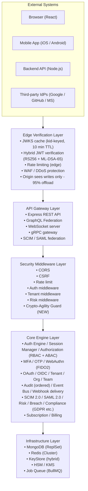

---

## 2. Package Architecture (Dependency Graph)

```mermaid
flowchart TB
    subgraph APP["Application Layer"]
        direction LR
        IS["identity-server"]
        AC["admin-console<br/>(React Admin)"]
        DP["developer-portal<br/>(React Developer)"]
    end
    subgraph SDK["SDK Layer"]
        direction LR
        S1["react"]
        S2["angular"]
        S3["vue"]
        S4["node"]
        S5["express"]
        S6["python"]
        S7["go"]
        S8["java"]
        S9["dotnet"]
        S10["cli"]
        S11["terraform"]
    end
    subgraph CORE["Core Layer"]
        direction LR
        C1["Services<br/>&bull; Auth, Session, MFA, OAuth<br/>&bull; RBAC / ABAC, Audit (ordered)<br/>&bull; Webhook, SCIM, SAML, Teams<br/>&bull; Billing, Events, ES / CQRS"]
        C2["Models<br/>&bull; User, Session, Tenant, Role<br/>&bull; OTP, Audit, Webhook, SCIM<br/>&bull; SAML, WebAuthn, Risk, Team<br/>&bull; Org, Subs, Policy"]
        C3["Middleware<br/>&bull; Auth, Tenant, Rate, CSRF<br/>&bull; CORS, Risk, MFA, Compliance<br/>&bull; Fresh perms"]
        C4["Adapters<br/>&bull; Email, SMS, Payment<br/>&bull; Storage, IDP, HSM, PQC"]
        C5["Plugins (NEW)<br/>&bull; Lifecycle<br/>&bull; Hooks<br/>&bull; Sandbox"]
    end
    subgraph SUPPORT["Support Layer"]
        direction LR
        OAUTH["oauth<br/>&bull; OAuth 2.1, OIDC, PKCE<br/>&bull; Provisioning, Federation<br/>&bull; SCIM, SAML"]
        CRYPTO["crypto<br/>&bull; Classical: Argon2, RSA, ECDSA, EdDSA,<br/>&nbsp;&nbsp;AES-GCM, SHA-256, JWT, KeyStore<br/>&bull; PQC (NEW): ML-KEM, ML-DSA,<br/>&nbsp;&nbsp;SLH-DSA, HSM, ZKP<br/>&bull; Hybrid (NEW): RS256 + ML-DSA,<br/>&nbsp;&nbsp;X25519 + ML-KEM"]
        SHARED["shared<br/>&bull; Types, Errors, Events, Consts"]
        INFRA["infra<br/>&bull; Docker, K8s / Helm, Terraform<br/>&bull; Monitoring, Logging, Secrets (NEW)"]
    end
    APP --> SDK
    SDK --> CORE
    CORE --> SUPPORT
```

---

## 3. Cryptography Architecture (NEW — Crypto Agility + PQC)

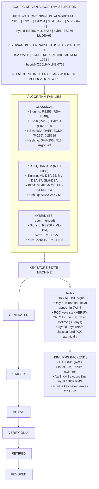

---

## 4. Authentication Flow (Hybrid PQC Signing)

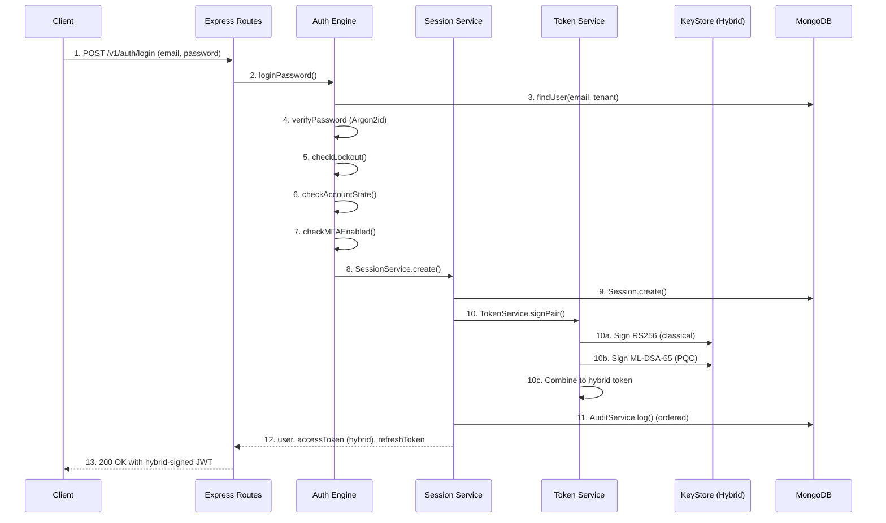

---

## 5. Edge Verification Flow (Origin Offload)

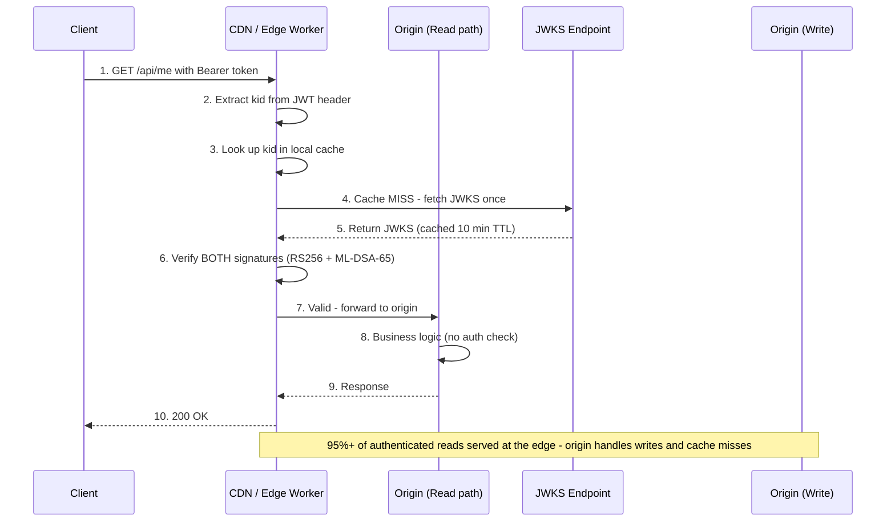

---

## 6. Refresh Token Rotation (Transactional, PQC-bound)

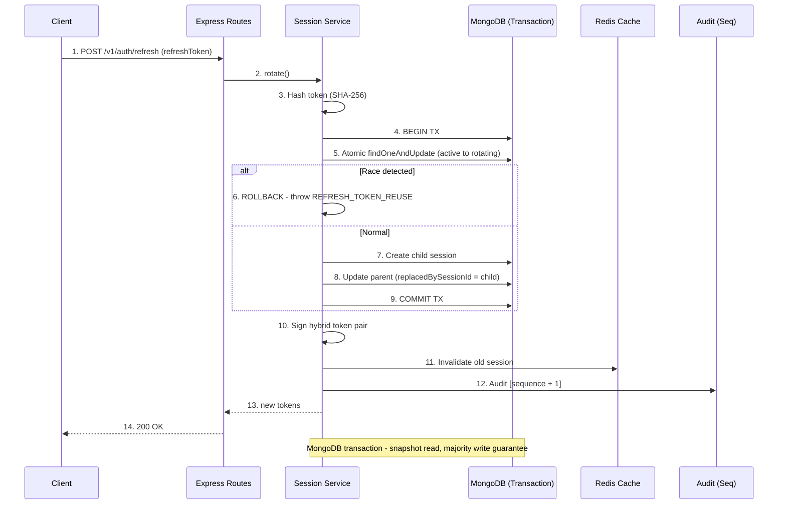

---

## 7. Data Model (Extended ER Diagram)

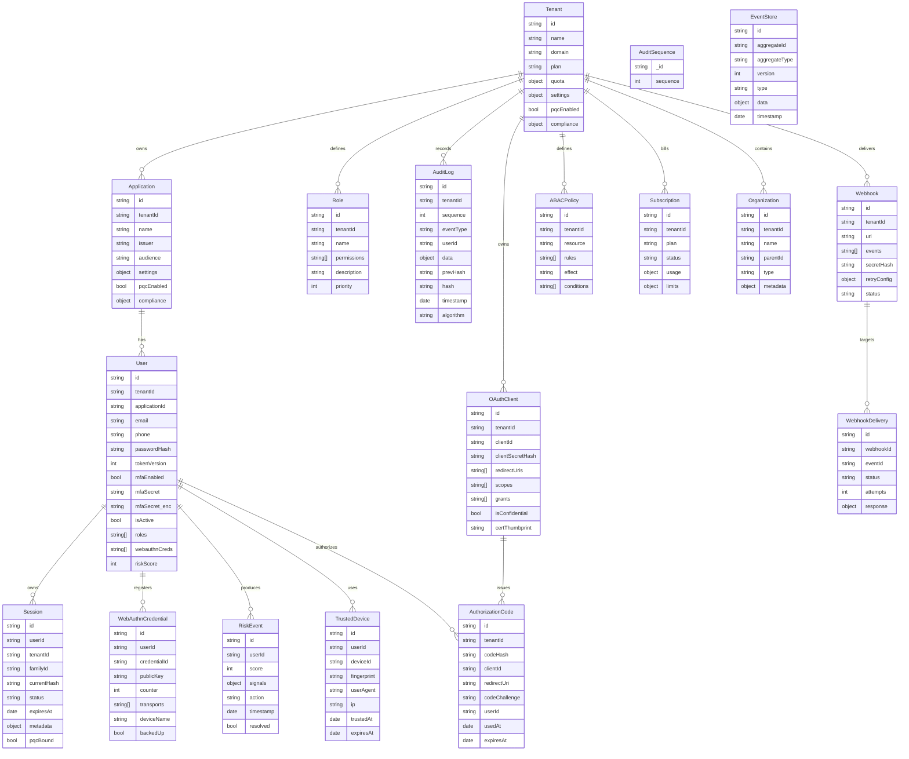

---

## 8. Security Architecture (Defense in Depth, Quantum-Safe)

```mermaid
flowchart TB
    subgraph L1["Layer 1: Network Security"]
        N1["&bull; TLS 1.3 Encryption (TLS_AES_256_GCM_SHA384)<br/>&bull; DDoS Protection (Cloudflare / AWS Shield)<br/>&bull; Web Application Firewall (WAF)<br/>&bull; IP Whitelisting / Blocklisting<br/>&bull; Edge Rate Limiting (10k RPS burst tolerance)"]
    end
    subgraph L2["Layer 2: Application Security"]
        N2["&bull; CORS Strict Allowlist (never wildcard)<br/>&bull; CSRF Double-Submit Cookies<br/>&bull; Security Headers (CSP, HSTS, X-Frame-Options)<br/>&bull; Input Validation and Sanitization (Zod schemas)<br/>&bull; NoSQL Injection Prevention<br/>&bull; Body Size Cap (100 KB default, env-tunable)"]
    end
    subgraph L3["Layer 3: Authentication Security (Quantum-Safe)"]
        N3["&bull; Argon2id Password Hashing (64 MiB, t=3, p=1)<br/>&bull; Hybrid JWT Signing: RS256 + ML-DSA-65 (NEW)<br/>&bull; Hybrid KEM: X25519 + ML-KEM-768 (NEW)<br/>&bull; MFA: TOTP, WebAuthn / FIDO2, SMS<br/>&bull; Adaptive Authentication (risk-based, 0-100 score)<br/>&bull; Account Lockout (5 attempts - 15 min lock)<br/>&bull; Brute Force Protection (per-IP + per-user)<br/>&bull; Credential Stuffing Prevention (HIBP K-Anonymity)<br/>&bull; Zero-Knowledge Proofs (age, membership, residency) (NEW)"]
    end
    subgraph L4["Layer 4: Session and Token Security"]
        N4["&bull; Short-lived Access Tokens (15 min, hybrid-signed)<br/>&bull; Rotating Refresh Tokens (one-time, transactional)<br/>&bull; Refresh Token Reuse - Family Revocation (atomic)<br/>&bull; HttpOnly, Secure, SameSite Cookies<br/>&bull; JWKS Publication (classical + PQC keys)<br/>&bull; Key Rotation State Machine (GENERATED-RETIRED-REVOKED)<br/>&bull; HSM-backed Signing (PKCS#11 / KMS)"]
    end
    subgraph L5["Layer 5: Authorization Security"]
        N5["&bull; Deny-by-Default<br/>&bull; Role-Based Access Control (RBAC)<br/>&bull; Attribute-Based Access Control (ABAC) (NEW)<br/>&bull; Tenant Isolation (all queries scoped)<br/>&bull; Permission Checks Server-Side<br/>&bull; IDOR / BOLA Prevention<br/>&bull; Opt-in Fresh Permission Re-check (NEW)"]
    end
    subgraph L6["Layer 6: Data Security"]
        N6["&bull; Encryption at Rest (MongoDB + AES-256)<br/>&bull; Encryption in Transit (TLS 1.3)<br/>&bull; Secrets Hashed at Rest (SHA-256 / SHA3-256)<br/>&bull; Field-Level Envelope Encryption (AES-256-GCM) (NEW)<br/>&bull; HSM / KMS for Signing Keys<br/>&bull; Audit Log Chain (strictly ordered, SHA-256) (NEW)<br/>&bull; Secret Provider Abstraction (Vault / KMS / Env / File) (NEW)"]
    end
    subgraph L7["Layer 7: Observability and Incident Response"]
        N7["&bull; Real-Time Monitoring (Prometheus / Grafana)<br/>&bull; Distributed Tracing (OpenTelemetry / Jaeger)<br/>&bull; Structured Logging (ELK / Loki)<br/>&bull; Security Alerts (breach detection, impossible travel)<br/>&bull; Incident Response Runbooks<br/>&bull; Disaster Recovery Drills (quarterly, automated)<br/>&bull; PQC algorithm visibility in traces (algorithm=hybrid-...) (NEW)"]
    end
    L1 --> L2 --> L3 --> L4 --> L5 --> L6 --> L7
```

---

## 9. Deployment Architecture (Multi-Region Active-Active, Quantum-Safe)

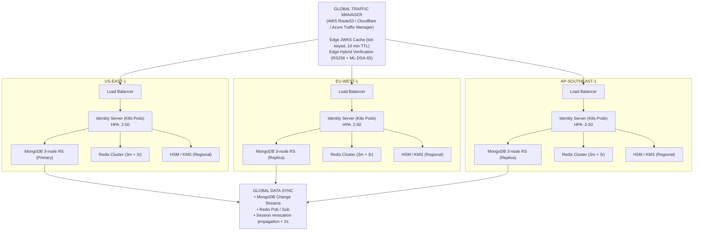

---

## 10. Caching Strategy (3-Tier)

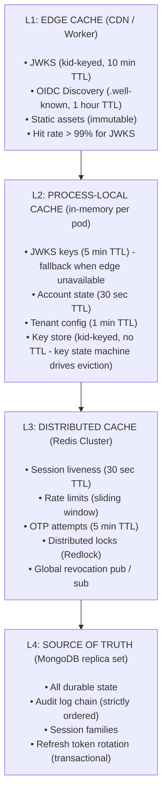

---

## 11. Observability Architecture

```mermaid
flowchart TB
    MET["METRICS (Prometheus)<br/><br/>HTTP Layer:<br/>&bull; pezhwan_http_requests_total{method, route, status}<br/>&bull; pezhwan_http_request_duration_seconds{method, route}<br/><br/>Auth Layer:<br/>&bull; pezhwan_auth_success_total{method, algorithm} (PQC visible)<br/>&bull; pezhwan_auth_failure_total{method, reason}<br/>&bull; pezhwan_mfa_locked_total{tenant}<br/><br/>Crypto Layer:<br/>&bull; pezhwan_jwt_sign_duration_seconds{algorithm}<br/>&bull; pezhwan_jwt_verify_duration_seconds{algorithm}<br/>&bull; pezhwan_key_rotation_age_days{kid, status}<br/><br/>Data Layer:<br/>&bull; pezhwan_db_query_duration_seconds{collection, op}<br/>&bull; pezhwan_db_pool_connections_active<br/>&bull; pezhwan_db_pool_waiting<br/>&bull; pezhwan_redis_hit_rate<br/><br/>Business:<br/>&bull; pezhwan_sessions_active{tenant}<br/>&bull; pezhwan_webhook_deliveries_total{status}<br/>&bull; pezhwan_rate_limit_hits_total{endpoint}"]
    MET --> TRC["TRACING (OpenTelemetry to Jaeger)<br/><br/>Spans:<br/>&bull; http.request<br/>&bull; auth.verify (algorithm=hybrid-RS256-MLDSA65)<br/>&bull; session.lookup<br/>&bull; audit.write (sequence=N)<br/>&bull; webhook.deliver<br/><br/>Attributes: user.id, tenant.id, session.id, algorithm, auth.method<br/>Sampling: configurable via PEZHWAN_OTEL_SAMPLING"]
    TRC --> LOG["LOGGING (Structured JSON to Loki / ELK)<br/><br/>Every log includes:<br/>&bull; requestId, correlationId<br/>&bull; userId, tenantId, sessionId<br/>&bull; algorithm (when crypto involved)<br/>&bull; No secrets (auto-redacted: password, tokens, keys, OTP)"]
    LOG --> AL["ALERTS (Prometheus Alertmanager)<br/><br/>&bull; HighAuthFailureRate (5xx &gt; 5% for 5m) [critical]<br/>&bull; RefreshTokenReuse (rate &gt; 10/min) [critical]<br/>&bull; MFA Lockouts Spike (&gt; 50/5m) [warning]<br/>&bull; Audit Chain Break (verification fails) [critical]<br/>&bull; Key Rotation Overdue (&gt; 35 days) [warning]<br/>&bull; DB Pool Exhausted (&gt; 95%) [critical]<br/>&bull; Redis Unavailable (ping fails 30s) [critical]<br/>&bull; Webhook Delivery Failing (&gt; 10% for 10m) [warning]<br/>&bull; Impossible Travel Detected [warning]"]
```

---

## 12. Key Performance Indicators (Updated)

### Performance (PQC-Updated)

| Metric                   | Target                                     |
| ------------------------ | ------------------------------------------ |
| Authentication (login)   | < 100 ms p95 (PQC signing impact accepted) |
| JWT verification (edge)  | < 10 ms p95 (hybrid verify, cached JWKS)   |
| Session refresh          | < 100 ms p95 (transactional rotation)      |
| Login throughput         | 10,000 RPS per instance                    |
| Verify throughput (edge) | 50,000 RPS per edge node                   |
| Database queries         | < 5 per request (write path only)          |

### Availability

| Metric                   | Target                          |
| ------------------------ | ------------------------------- |
| Uptime SLO               | 99.99% (≈ 52 min/year downtime) |
| Recovery Time Objective  | < 60 seconds                    |
| Recovery Point Objective | < 24 hours                      |
| Redis availability       | 99.95%                          |
| MongoDB availability     | 99.99%                          |
| Multi-region failover    | < 30 seconds                    |

### Security (Quantum-Safe)

| Metric           | Target                                    |
| ---------------- | ----------------------------------------- |
| Password hashing | Argon2id (64 MiB, t=3, p=1)               |
| JWT signing      | Hybrid RS256 + ML-DSA-65 (default)        |
| Session KEM      | Hybrid X25519 + ML-KEM-768                |
| Token TTL        | 15 min (access), 30 days (refresh)        |
| Rate limits      | 10/min (login), 5/min (OTP)               |
| MFA lockout      | 5 attempts → 15-min lock                  |
| Refresh rotation | 1 success / 7 reuse-rejected (concurrent) |
| Crypto agility   | 0 hardcoded algorithms in app code        |

### Scalability

| Metric                | Target                                 |
| --------------------- | -------------------------------------- |
| Horizontal scaling    | Unlimited instances (stateless verify) |
| DB connections/pod    | 25 (pooled, multiplexed)               |
| Redis connections/pod | 50                                     |
| Cache hit rate        | > 95% (L1 + L2 + L3 combined)          |
| Origin offload        | > 95% of reads served at edge          |

---

## 13. Technology Stack (Updated)

### Runtime & Language

- Node.js 24+ (primary runtime)
- TypeScript 5+ (SDK + server)
- Python 3.10+ (SDK)
- Go 1.21+ (SDK)
- Java 17+ (SDK)
- .NET 8+ (SDK)

### Cryptography (Updated)

- **Classical:** RS256, ES256, EdDSA, Argon2id, AES-256-GCM, SHA-256
- **PQC:** ML-KEM-768/1024, ML-DSA-65/87, SLH-DSA (NIST FIPS 203-205)
- **Hybrid:** RS256 + ML-DSA-65, ES256 + ML-DSA-65, X25519 + ML-KEM-768
- **ZKP:** ZK-SNARKs, ZK-STARKs (age / membership / residency proofs)
- **HSM:** PKCS#11, AWS KMS, Azure Key Vault, GCP KMS
- **Libraries:** @noble/post-quantum, jose, argon2, snarkjs, circomlib

### Frameworks & Libraries

- Express.js 5+ (HTTP server)
- Apollo Server (GraphQL Federation)
- Socket.io + Redis adapter (WebSocket)
- Mongoose (MongoDB ODM)
- ioredis (Redis client)
- BullMQ (job queue for webhooks, OTP, cleanup)
- simplewebauthn (WebAuthn / FIDO2)
- samlify (SAML 2.0 SP)

### Data Stores

- MongoDB 7 (primary DB, 3-node replica set, transactions)
- Redis 7 (cache, rate limiting, pub/sub, locks, streams)
- AWS S3 / GCS (encrypted backup storage, audit archive)
- Elasticsearch (audit search / analytics)

### Secret Management (Updated)

- SecretProvider abstraction (Env / File / Chain / Vault / KMS)
- HashiCorp Vault, AWS Secrets Manager, Azure Key Vault
- Kubernetes Secrets (mounted volumes, not env vars)
- Rotation: automated, per-secret policy

### Observability

- Prometheus + Grafana (metrics and dashboards)
- OpenTelemetry → Jaeger (distributed tracing)
- Loki (log aggregation)
- Sentry (error tracking)
- Alertmanager (routing, silencing)

### Infrastructure

- Docker + Distroless base images
- Kubernetes (EKS / AKS / GKE) + Helm charts
- Terraform (IaC) + Terraform provider for Pezhwan resources
- GitHub Actions (CI/CD) with security gates
- PgBouncer-equivalent Mongo connection pooling

---

## 14. Architecture Summary (Updated)

| Aspect                          | Design Choice                                   | Rationale                                            |
| ------------------------------- | ----------------------------------------------- | ---------------------------------------------------- |
| **Modular Monorepo**            | npm workspaces                                  | Code sharing, versioning, single build               |
| **Package Layering**            | Strict dependency direction                     | Clear boundaries, testability                        |
| **Crypto Agility**              | Config-driven algorithm selection               | Zero-downtime migration to PQC via env var           |
| **Hybrid PQC**                  | RS256 + ML-DSA-65 JWT signing                   | NIST + BSI recommended defense-in-depth              |
| **Hybrid KEM**                  | X25519 + ML-KEM-768 for session secrets         | Post-quantum confidentiality for harvest-now attacks |
| **Edge Verification**           | JWKS cached at CDN, kid-keyed                   | 50k RPS verify, 95%+ origin offload                  |
| **Stateless Core**              | JWT with local verification                     | Horizontal scaling, no session lookup                |
| **Stateful Operations**         | MongoDB replica set + transactions              | Durability, auditability, atomic rotation            |
| **Redis as Cache**              | Performance accelerator, never gate             | Reduces DB load, distributed limits                  |
| **Strict Audit Ordering**       | Atomic sequence + transaction                   | No forks under HA writers                            |
| **Fail-Closed Security**        | No identity on uncertainty                      | Security over availability                           |
| **Secret Provider Abstraction** | Vault/KMS/Env/File behind interface             | Swappable without code change                        |
| **Multi-Language SDKs**         | 7+ languages, published to registries           | Developer adoption, ecosystem                        |
| **Enterprise Features**         | ABAC, SCIM, SAML, Webhooks, Teams               | Enterprise requirements                              |
| **Observability**               | Prometheus + OTEL + Loki                        | Full request lifecycle visibility                    |
| **Multi-Region Active-Active**  | 3+ regions, global revocation < 2s              | Global reach, resilience                             |
| **Rate Limiting**               | Distributed, fail-closed on Redis outage        | Strong multi-instance abuse protection               |
| **MFA Depth**                   | TOTP + WebAuthn + backup codes + trusted device | Defense in depth for account takeover                |

---

## Key Architectural Improvements in This Revision

1. **Crypto agility is now a first-class architectural concern** — every algorithm is a config value; a "Crypto-Agility Guard" middleware prevents hardcoded algorithms from entering the codebase.

2. **Hybrid PQC is the default signing mode** — every JWT carries two signatures (RS256 + ML-DSA-65); both must verify. JWKS publishes both classical and PQC keys with separate `kid`s.

3. **Edge verification layer** is now explicit in the system context — the origin server only sees writes and cache misses, unlocking 50k RPS verification at the edge.

4. **Audit log has strict ordering** via an `AuditSequence` model and transactional writes — no more best-effort chain that can fork under HA.

5. **Refresh rotation is fully transactional** — the session rotation uses MongoDB transactions with `snapshot` read concern and `majority` write concern, eliminating the orphaned-session crash window.

6. **Secrets are abstracted behind `SecretProvider`** — the same application code works with env vars (dev), file mounts (K8s), or Vault/KMS (production) without modification.

7. **Rate limiting is distributed and fail-closed** — the security posture does not degrade when Redis is unavailable; the choice is explicit and documented.

8. **Multi-region is active-active** with global session revocation propagating in under 2 seconds via Redis Pub/Sub plus MongoDB change streams.

9. **Observability includes crypto algorithm labels** — `algorithm=hybrid-RS256-MLDSA65` is visible in every metric and trace, enabling measurement of PQC adoption.

10. **Zero-knowledge proofs** are integrated for privacy-preserving scenarios (age verification, group membership, residency) without revealing underlying attributes.

11. **HSM/KMS is a first-class key backend** — the `KeyStore` interface accepts a `HsmProvider`, and private key material never appears in application memory.

12. **Compliance is architecturally embedded** — GDPR/HIPAA/PCI/SOC2/CCPA services are part of the core layer, not bolted on.

---
