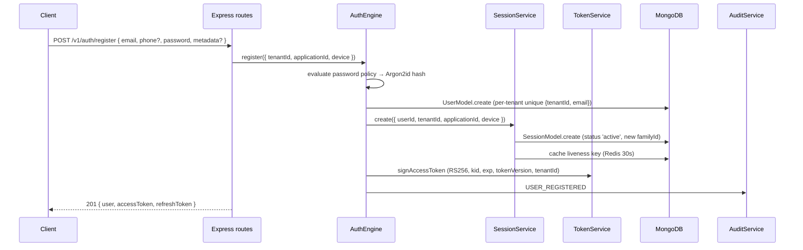
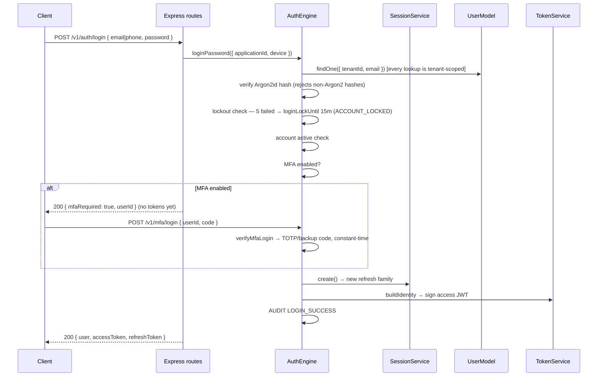
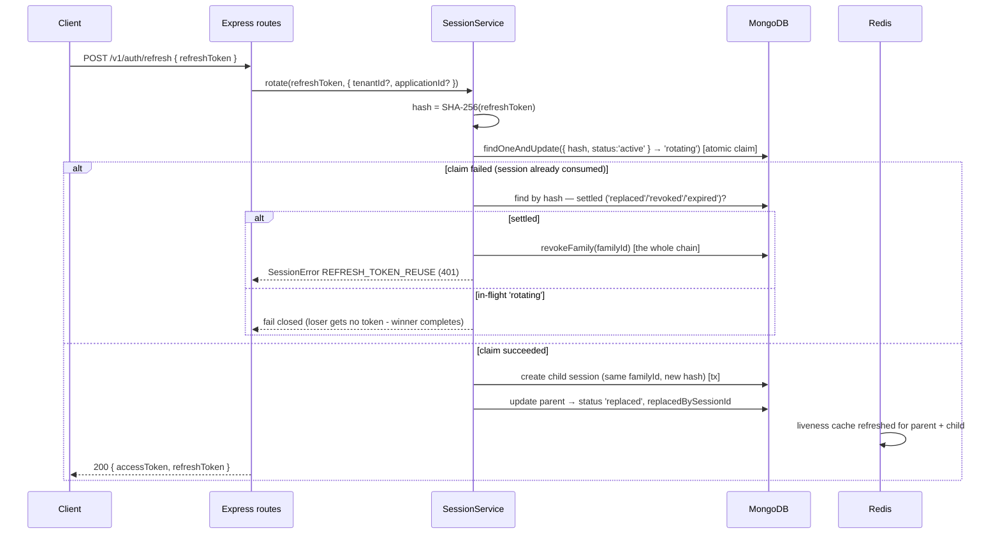
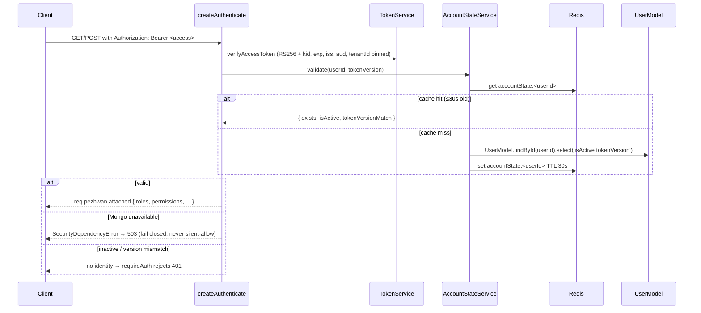

# PEZHWAN Authentication Data Flows

This document walks every authentication flow end-to-end. It is grounded in
`../ARCHITECTURE.md` (the concise design reference) and `../THREAT-MODEL.md`
(the STRIDE model with source-verified controls). Services referenced live in
`packages/core/src/{auth,services}/`.

Every flow follows the same middleware pipeline at the HTTP layer
(`apps/identity-server/src/server.ts`):

```
requestContext (requestId/correlationId/X-Response-Time)
→ securityHeaders (CSP, HSTS, nosniff, frame/referrer/permissions policy)
→ corsAllowlist (exact origins; never wildcard with credentials)
→ createAuthenticate (optional: attach req.pezhwan when a token is present)
→ csrfProtection (double-submit cookie on non-safe methods under /v1/auth /v1/mfa /v1/verify)
→ rateLimit (login/register/otp/refresh/api/mfa budget by IP or user)
→ route handler → error handler (envelope { success, data | error })
```

## 1. Register



Enumeration safety: a duplicate email returns a 400 validation envelope without
distinguishing "exists" from other policy failures.

## 2. Login (password + MFA gate)



The MFA gate means a valid password never mints tokens while TOTP is enabled
(`auth/auth.engine.ts`). Disabling MFA itself requires a currently-valid
code/backup code.

## 3. OTP login (passwordless)

```
POST /v1/auth/otp/send { channel, target, purpose }
  → validate channel/target/purpose (OTP_PARAMS_REQUIRED otherwise)
  → OtpService.request: one live code per key (unique index),
    resend cooldown 30s → { retryAfterSeconds }, OTP TTL 5m, 6 digits
  → delivered via email/SMS provider (ProviderError on failure → 502)

POST /v1/auth/otp/verify { channel, target, purpose, code }
  → constant-time verify of SHA-256(code) against stored hash
  → ≤5 attempts; exhaustion blocks verify AND regenerate
  → unknown targets burn the cooldown and return a generic 'expired'

POST /v1/auth/otp/login { channel, target, code }
  → same verification, then completes login (MFA-gated when enabled)
  → 200 { user, accessToken, refreshToken } or { mfaRequired, userId }
```

OTP state is keyed by tenant+application and hashed at rest
(`packages/crypto/src/otp.ts`).

## 4. Refresh rotation (active → rotating → replaced; reuse → family revoke)



Child creation and parent finalization are wrapped in a MongoDB transaction
when the topology supports it; the atomic `active → rotating` claim serializes
concurrent presentations of the same token to exactly one winner. Only SHA-256
hash values of refresh tokens are stored (`session.model.ts:51`).

## 5. Logout / revoke

```
POST /v1/auth/logout                       → revoke(current sessionId)
POST /v1/sessions/all/revoke               → revokeAll(userId, applicationId)
POST /v1/sessions/:id/revoke               → ownership-checked single revoke

SessionService.revoke:
  SessionModel.updateOne({ _id } { status:'revoked', revokedAt })
  cache.del(`session:<id>`)                → Redis liveness evicted

revokeFamily(familyId):                    → used by reuse detection, mass logout
  updateMany({ familyId } → 'revoked') + evict every cached marker
```

Revocation invalidates both the token path (session status) and the Redis
liveness path used by `isSessionActive`.

## 6. Authenticated request with account-state validation



Password change/reset bumps `tokenVersion` and calls `accountState.invalidate`,
so outstanding access tokens stop verifying within the 30s cache TTL
(`auth/auth.engine.ts`). Machine identities (`client_credentials`, API keys)
carry no user account behind the token; their validity is the signature plus a
live key lookup.

## 7. OAuth authorization-code + PKCE (OAuth 2.1)

```
GET /v1/oauth/authorize?client_id&redirect_uri&response_type=code&scope=openid
                      &state&nonce&code_challenge&code_challenge_method=S256    [Bearer]
  → client lookup (registered client, exact redirect_uris match)
  → PKCE: public clients REQUIRE code_challenge S256 (PKCE_REQUIRED otherwise)
  → scope containment (INVALID_SCOPE when not granted)
  → 302 Location: redirect_uri#code=...&state=...

POST /v1/oauth/token  grant_type=authorization_code&code&code_verifier
                      &client_id(&client_secret)&redirect_uri
  → atomic single-use redeem (findOneAndUpdate on consumedAt:null, unique codeHash)
  → constant-time S256 verification of code_verifier
  → PKCE failure → INVALID_GRANT + the bound session is revoked (security event)
  → 200 { access_token, token_type, expires_in, refresh_token, id_token, scope }

Other grants: refresh_token (rotating refresh within the session family),
client_credentials (service identity, `sub = client:<clientId>`).
```

Tokens are audience-scoped (`pezhwan.clients`), carry `tenantId` + `kid`, and
receive `nonce`/`aud` shaping for the ID token.

## 8. Magic-link / verification-token flow

```
POST /v1/verify/magic/send { email, redirectUri }
  → VerificationTokenService.issue (single-purpose, expiring, SHA-256 hashed)
  → { expiresIn }  (enumeration-safe: unknown accounts burn a decoy-style token)

User opens: <redirectUri>?magic=<token>  (signed link, constant-time compare)

POST /v1/verify/magic/redeem { token }
  → redeem(): lookup by hash, single-use consume, expiry + purpose check
  → session created (MFA-gated when enabled)
  → 200 { user, accessToken, refreshToken, redirectUri }
```

The same token service backs password-reset tokens
(`/v1/verify/password/forgot` → `/v1/verify/password/reset/confirm`) with a
15-minute lifetime and email-verification tokens (`/v1/verify/email/verify-token`,
24-hour lifetime), per `DEFAULT_TTL`.
