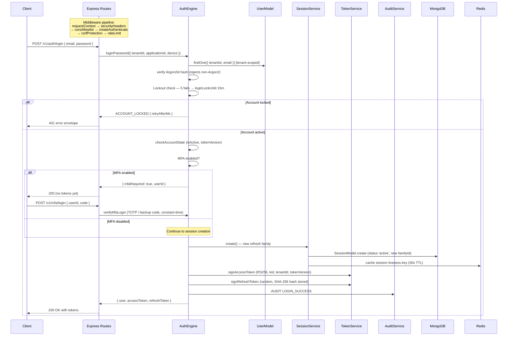
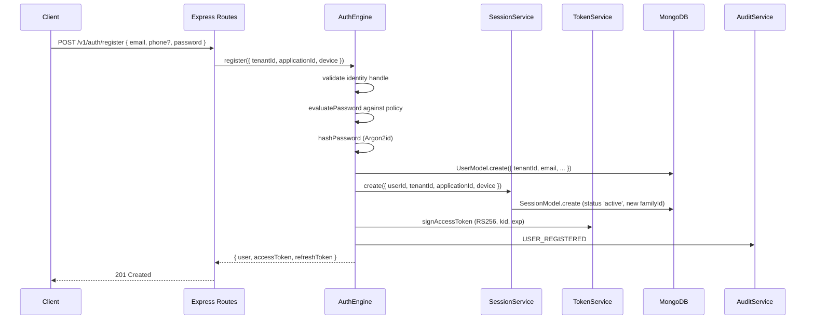
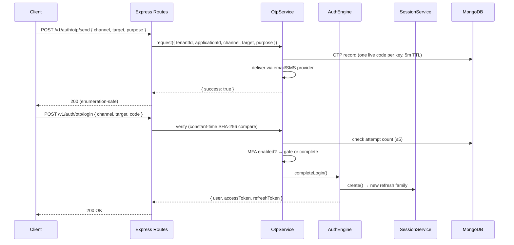

# Authentication Flows

## Login (Password + MFA Gate)

## Register

Note: Duplicate email returns 400 validation envelope without distinguishing "exists" from other policy failures (enumeration-safe).

## OTP Login (Passwordless)

