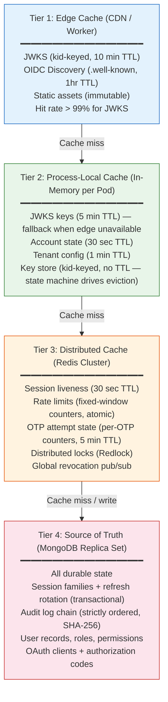

# Caching Strategy — 4 Tier Hierarchy

From edge CDN to MongoDB source of truth, each tier serves a specific purpose.

## Redis Key Reference

| Key Pattern                | TTL            | Purpose                             |
| -------------------------- | -------------- | ----------------------------------- |
| `session:<id>`             | 30s            | Cheap `isSessionActive` check       |
| `accountState:<userId>`    | 30s            | Token version gate on every request |
| `rl:<type>:<scope>`        | Sliding window | Atomic rate limit counters          |
| `otp:<tenant>:<app>:<key>` | 5m             | OTP attempt state + cooldown        |
| `lock:<resource>`          | Redlock TTL    | Distributed coordination            |

## Caching Decision Rules

| Data              | Tier    | Rationale                                           |
| ----------------- | ------- | --------------------------------------------------- |
| JWKS              | L1 + L2 | Read-heavy, rarely changes; 10min/5min TTL          |
| Account state     | L2 + L3 | Checked every request; 30s TTL; fail-closed on miss |
| Session liveness  | L3      | Hot path; 30s TTL; evicted on revocation            |
| Rate limits       | L3      | Shared across pods; atomic counters                 |
| All durable state | L4      | Source of truth; transactional writes               |

## Performance Targets

| Metric                             | Target     |
| ---------------------------------- | ---------- |
| Combined cache hit rate (L1+L2+L3) | > 95%      |
| Edge JWKS hit rate                 | > 99%      |
| DB queries per request             | < 5        |
| Token verification (edge)          | < 10ms p95 |
| Session lookup (cached)            | < 20ms p95 |
