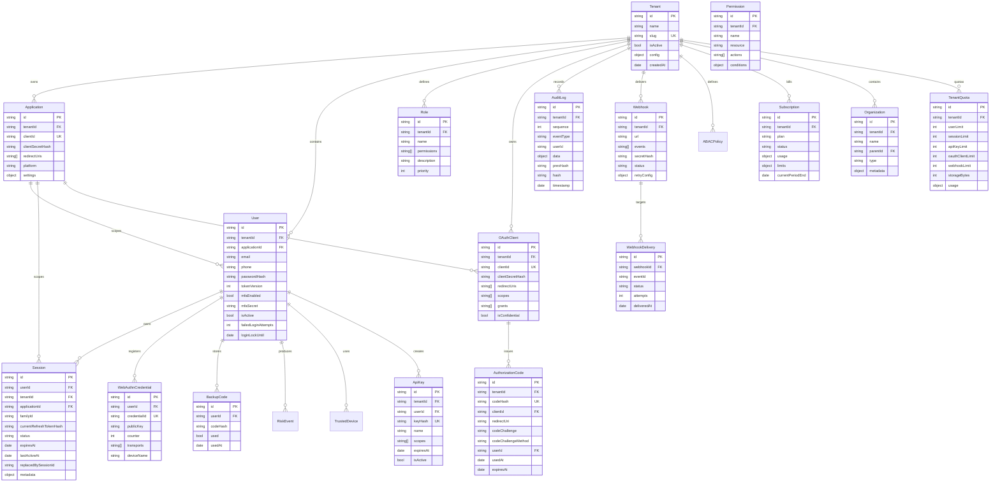

# Data Model — ER Diagram

Core entities and their relationships. Every entity is tenant-scoped.

## Key Indexes

| Model             | Unique/Compound Index                  | Purpose                           |
| ----------------- | -------------------------------------- | --------------------------------- |
| User              | `{ tenantId, email }` (sparse)         | Tenant-scoped login lookup        |
| User              | `{ tenantId, phone }` (sparse)         | Tenant-scoped phone login         |
| Session           | `{ currentRefreshTokenHash }` (unique) | One-time-use refresh token lookup |
| Session           | `{ familyId }`                         | Family revocation on reuse        |
| OAuthClient       | `{ tenantId, clientId }`               | Tenant-scoped client lookup       |
| AuthorizationCode | `{ codeHash }` (unique)                | Single-use code redemption        |
| AuditLog          | `{ tenantId, sequence }`               | Ordered audit chain               |
| ApiKey            | `{ keyHash }` (unique)                 | Global API key lookup             |
| BackupCode        | `{ codeHash }` (unique)                | Single-use backup code            |
