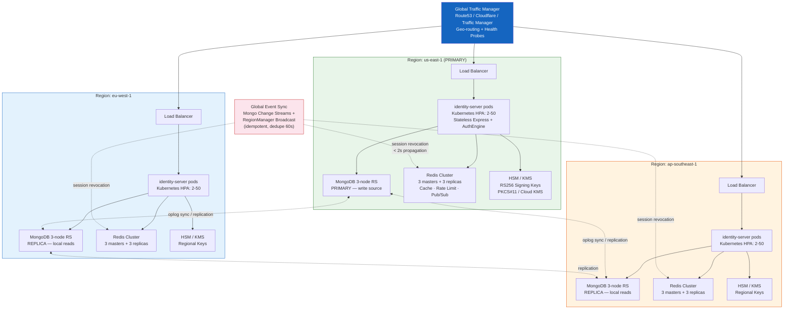
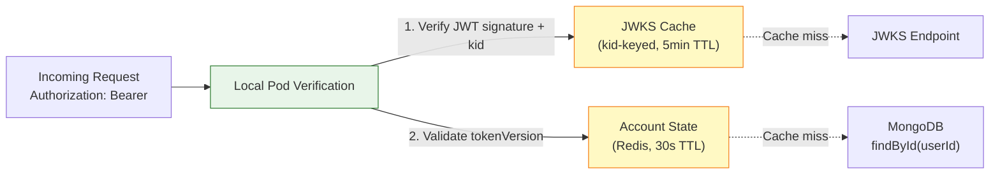

# Multi-Region Active-Active Deployment

Global load balancing with regional identity server pods, MongoDB replication, and Redis cache clusters.

## Scaling Requirements

| Requirement                   | Value                                       |
| ----------------------------- | ------------------------------------------- |
| `trust proxy`                 | 1 (real client IP for audit + rate-limit)   |
| Shared Redis                  | Single Redis URL across all pods            |
| Signing key persistence       | `FileKeyStoreAdapter` (shared volume / KMS) |
| HPA target                    | CPU 60%, min 2 / max 50 pods per region     |
| Mongo connections/node        | 100 (pooled)                                |
| Redis connections/node        | 50                                          |
| Global revocation propagation | < 2 seconds                                 |

## Horizontal Scaling — Stateless Verification

No shared in-memory state needed — every pod is interchangeable. Access tokens verify locally against JWKS + Redis account state.
