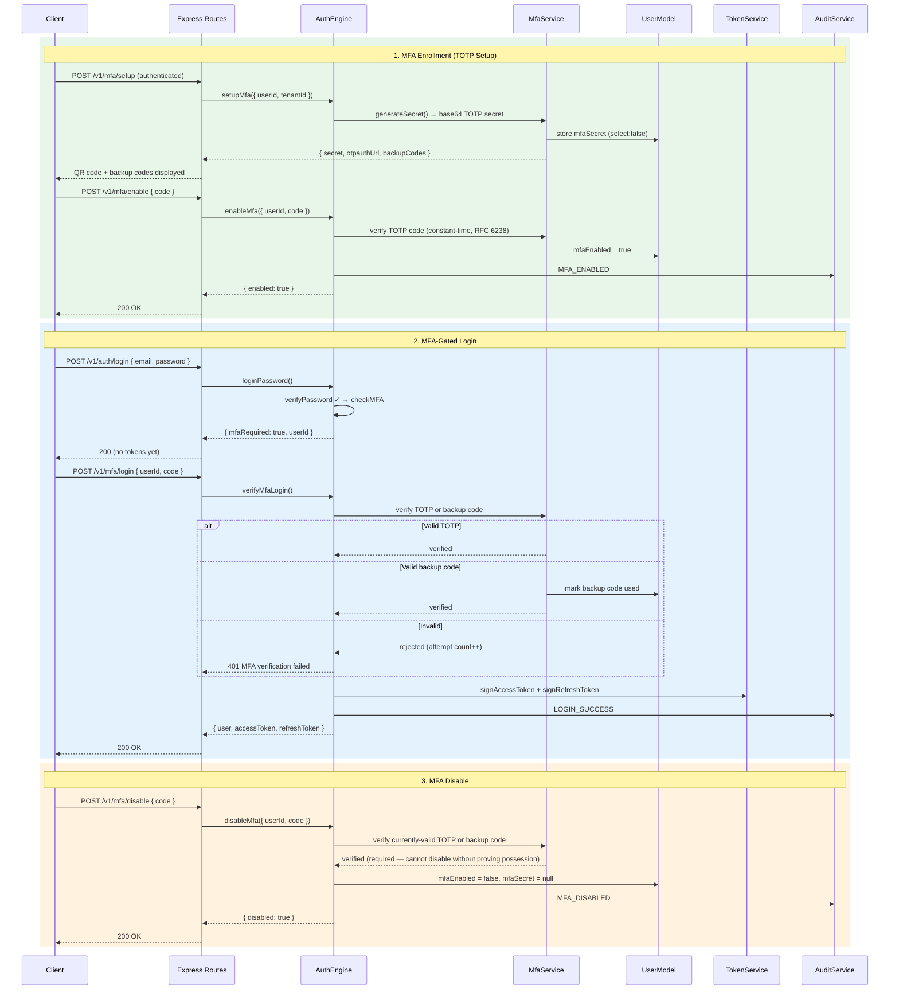

# MFA Flow

TOTP enrollment, MFA-gated login, and disable flow.

## Key Security Properties

| Property                                   | Implementation                                                        |
| ------------------------------------------ | --------------------------------------------------------------------- |
| TOTP algorithm                             | RFC 6238, 30s step, ±1 skew, 6 digits                                 |
| Constant-time compare                      | `packages/crypto/src/totp.ts:126`                                     |
| Backup codes                               | SHA-256 hashed, single-use unique `codeHash`                          |
| TOTP secret at rest                        | Base64 stored (unhashed — required for verify), `select:false`        |
| Disable requires valid code                | `mfa.service.ts:194-211` — cannot disable without proof of possession |
| Brute-force protection                     | Per-user attempt counter + 15-min lock on user document               |
| Login never mints tokens while MFA enabled | `auth/auth.engine.ts:311-321,409-419`                                 |
