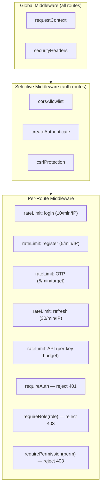

# Middleware Pipeline

Every HTTP request crosses this pipeline before reaching the route handler.

```mermaid
flowchart LR
    REQ["Incoming Request"]
    RC["requestContext<br/>━━━━━━━━━━━━━<br/>requestId / correlationId<br/>X-Response-Time"]
    SH["securityHeaders<br/>━━━━━━━━━━━━━<br/>CSP, HSTS, nosniff<br/>X-Frame-Options<br/>Referrer-Policy<br/>Permissions-Policy"]
    CORS["corsAllowlist<br/>━━━━━━━━━━━━━<br/>Exact origin match<br/>Never wildcard + credentials<br/>Echo origin on safe reads"]
    AUTH["createAuthenticate<br/>━━━━━━━━━━━━━<br/>Extract Bearer token<br/>Verify RS256 JWT<br/>Validate account state<br/>Attach req.pezhwan"]
    CSRF["csrfProtection<br/>━━━━━━━━━━━━━<br/>Double-submit cookie<br/>SameSite=Lax<br/>/v1/auth + /v1/mfa + /v1/verify"]
    RL["rateLimit<br/>━━━━━━━━━━━━━<br/>Per-route budgets<br/>login: 10/min<br/>register: 5/min<br/>OTP: 5/min<br/>refresh: 30/min"]
    HANDLER["Route Handler<br/>━━━━━━━━━━━━━<br/>AuthEngine methods<br/>{ success, data | error }"]

    REQ --> RC --> SH --> CORS --> AUTH --> CSRF --> RL --> HANDLER

    style REQ fill:#e3f2fd,stroke:#1565c0
    style RC fill:#e8f5e9,stroke:#2e7d32
    style SH fill:#e8f5e9,stroke:#2e7d32
    style CORS fill:#e8f5e9,stroke:#2e7d32
    style AUTH fill:#fff3e0,stroke:#e65100
    style CSRF fill:#fff3e0,stroke:#e65100
    style RL fill:#fce4ec,stroke:#c62828
    style HANDLER fill:#f3e5f5,stroke:#6a1b9a
```



## Error Response Envelope

All responses (success and error) use a consistent envelope:

```json
{
  "success": true,
  "data": { "user": {...}, "accessToken": "...", "refreshToken": "..." }
}
```

```json
{
  "success": false,
  "error": { "code": "INVALID_CREDENTIALS", "message": "..." }
}
```

## Middleware Application Points


