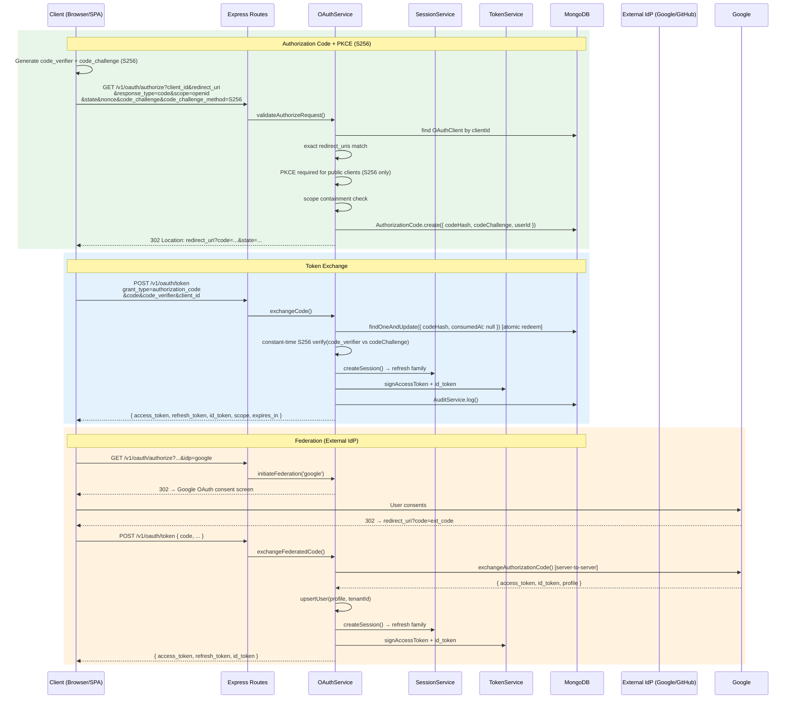

# OAuth 2.1 / OIDC Authorization Code + PKCE Flow

## Key Security Properties

| Property                  | Implementation                                                                 |
| ------------------------- | ------------------------------------------------------------------------------ |
| Authorization code replay | Single-use atomic `findOneAndUpdate` on `consumedAt: null` + unique `codeHash` |
| PKCE enforcement          | Public clients **require** `code_challenge` S256 (`oauth.service.ts:141`)      |
| PKCE failure              | Bound session is revoked (security event)                                      |
| Redirect URI tampering    | Exact match against registered `redirect_uris`                                 |
| Client secret storage     | SHA-256 hashed, never plaintext (`oauth.service.ts:177`)                       |
| Token audience            | Audience-scoped (`pezhwan.clients`), `tenantId` + `kid` carried                |
| Constant-time compare     | S256 verification uses `timingSafeEqual`                                       |
