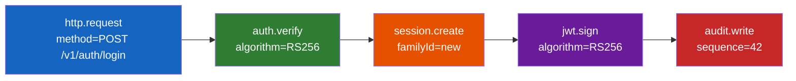

# Observability Architecture

Metrics, tracing, logging, and alerting across the full request lifecycle.

```mermaid
flowchart TB
    subgraph METRICS["Metrics (Prometheus)"]
        M_HTTP["HTTP Layer<br/>pezhwan_http_requests_total{method, route, status}<br/>pezhwan_http_request_duration_seconds{method, route}"]
        M_AUTH["Auth Layer<br/>pezhwan_auth_success_total{method, algorithm}<br/>pezhwan_auth_failure_total{method, reason}<br/>pezhwan_mfa_locked_total{tenant}"]
        M_CRYPTO["Crypto Layer<br/>pezhwan_jwt_sign_duration_seconds{algorithm}<br/>pezhwan_jwt_verify_duration_seconds{algorithm}<br/>pezhwan_key_rotation_age_days{kid, status}"]
        M_DATA["Data Layer<br/>pezhwan_db_query_duration_seconds{collection, op}<br/>pezhwan_db_pool_connections_active<br/>pezhwan_redis_hit_rate"]
        M_BIZ["Business<br/>pezhwan_sessions_active{tenant}<br/>pezhwan_webhook_deliveries_total{status}<br/>pezhwan_rate_limit_hits_total{endpoint}"]
    end

    subgraph TRACING["Tracing (OpenTelemetry → Jaeger)"]
        T_SPANS["Spans<br/>http.request<br/>auth.verify (algorithm=labelled)<br/>session.lookup<br/>audit.write (sequence=N)<br/>webhook.deliver"]
        T_ATTR["Attributes<br/>user.id, tenant.id, sessionId<br/>algorithm, auth.method<br/>Sampling: PEZHWAN_OTEL_SAMPLING"]
    end

    subgraph LOGGING["Logging (Structured JSON → Loki / ELK)"]
        L_CTX["Context on Every Log<br/>requestId, correlationId<br/>userId, tenantId, sessionId<br/>algorithm (when crypto involved)"]
        L_REDACT["Auto-Redaction<br/>password, tokens, keys<br/>OTP, clientSecret, codeVerifier<br/>mfaSecret, totp"]
    end

    subgraph ALERTS["Alerts (Prometheus Alertmanager)"]
        A_CRIT["Critical<br/>HighAuthFailureRate (5xx > 5% for 5m)<br/>RefreshTokenReuse (rate > 10/min)<br/>AuditChainBreak (verification fails)<br/>DBPoolExhausted (> 95%)<br/>RedisUnavailable (ping fails 30s)"]
        A_WARN["Warning<br/>MFA Lockouts Spike (> 50/5m)<br/>KeyRotationOverdue (> 35 days)<br/>WebhookDeliveryFailing (> 10% for 10m)<br/>ImpossibleTravelDetected"]
    end

    METRICS --> TRACING --> LOGGING --> ALERTS

    style METRICS fill:#e3f2fd,stroke:#1565c0
    style TRACING fill:#e8f5e9,stroke:#2e7d32
    style LOGGING fill:#fff3e0,stroke:#e65100
    style ALERTS fill:#fce4ec,stroke:#c62828
```

## Metrics Naming Convention

All metrics are prefixed with `pezhwan_` and use consistent label shapes:

| Metric                                  | Labels                | Type      |
| --------------------------------------- | --------------------- | --------- |
| `pezhwan_http_requests_total`           | method, route, status | Counter   |
| `pezhwan_http_request_duration_seconds` | method, route         | Histogram |
| `pezhwan_auth_success_total`            | method, algorithm     | Counter   |
| `pezhwan_auth_failure_total`            | method, reason        | Counter   |
| `pezhwan_jwt_sign_duration_seconds`     | algorithm             | Histogram |
| `pezhwan_jwt_verify_duration_seconds`   | algorithm             | Histogram |
| `pezhwan_sessions_active`               | tenant                | Gauge     |
| `pezhwan_rate_limit_hits_total`         | endpoint              | Counter   |
| `pezhwan_key_rotation_age_days`         | kid, status           | Gauge     |

## Trace Span Hierarchy

