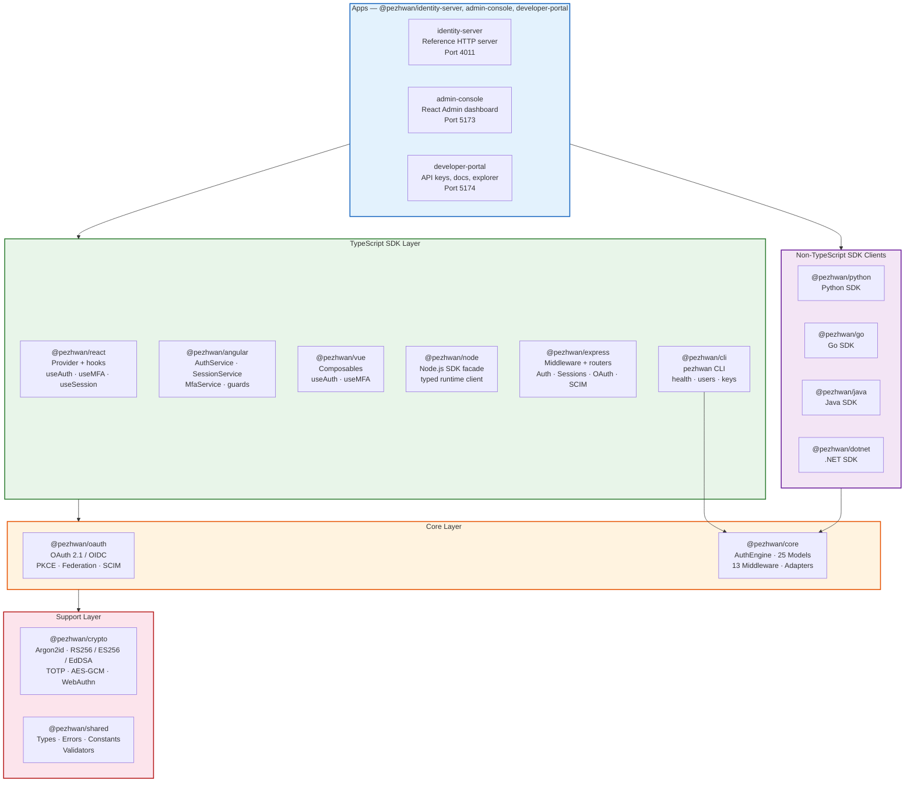
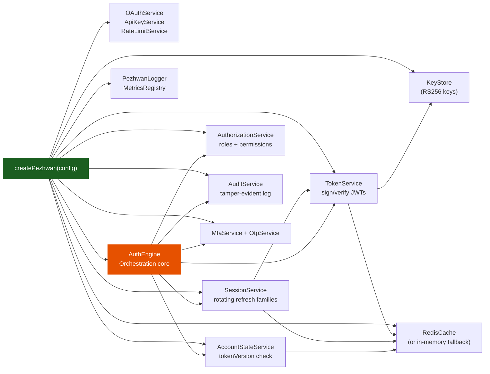

# Package Dependency Graph

Shows the layered monorepo dependency direction. Lower layers never depend on upper layers.

```mermaid
flowchart TB
    subgraph APPS["Apps — @pezhwan/identity-server, admin-console, developer-portal"]
        IS["identity-server<br/>Reference HTTP server<br/>Port 4011"]
        AC["admin-console<br/>React Admin dashboard<br/>Port 5173"]
        DP["developer-portal<br/>API keys, docs, explorer<br/>Port 5174"]
    end

    subgraph SDK_TS["TypeScript SDK Layer"]
        REACT["@pezhwan/react<br/>Provider + hooks<br/>useAuth · useMFA · useSession"]
        ANGULAR["@pezhwan/angular<br/>AuthService · SessionService<br/>MfaService · guards"]
        VUE["@pezhwan/vue<br/>Composables<br/>useAuth · useMFA"]
        NODE["@pezhwan/node<br/>Node.js SDK facade<br/>typed runtime client"]
        EXPRESS["@pezhwan/express<br/>Middleware + routers<br/>Auth · Sessions · OAuth · SCIM"]
        CLI["@pezhwan/cli<br/>pezhwan CLI<br/>health · users · keys"]
    end

    subgraph SDK_LANG["Non-TypeScript SDK Clients"]
        PYTHON["@pezhwan/python<br/>Python SDK"]
        GO["@pezhwan/go<br/>Go SDK"]
        JAVA["@pezhwan/java<br/>Java SDK"]
        DOTNET["@pezhwan/dotnet<br/>.NET SDK"]
    end

    subgraph CORE["Core Layer"]
        OAUTH["@pezhwan/oauth<br/>OAuth 2.1 / OIDC<br/>PKCE · Federation · SCIM"]
        CORE_PKG["@pezhwan/core<br/>AuthEngine · 25 Models<br/>13 Middleware · Adapters"]
    end

    subgraph SUPPORT["Support Layer"]
        CRYPTO["@pezhwan/crypto<br/>Argon2id · RS256 / ES256 / EdDSA<br/>TOTP · AES-GCM · WebAuthn"]
        SHARED["@pezhwan/shared<br/>Types · Errors · Constants<br/>Validators"]
    end

    APPS --> SDK_TS
    APPS --> SDK_LANG
    SDK_TS --> CORE
    SDK_LANG --> CORE_PKG
    CORE --> SUPPORT
    CLI --> CORE_PKG

    style APPS fill:#e3f2fd,stroke:#1565c0,stroke-width:2px
    style SDK_TS fill:#e8f5e9,stroke:#2e7d32,stroke-width:2px
    style SDK_LANG fill:#f3e5f5,stroke:#6a1b9a,stroke-width:2px
    style CORE fill:#fff3e0,stroke:#e65100,stroke-width:2px
    style SUPPORT fill:#fce4ec,stroke:#b71c1c,stroke-width:2px
```

## Runtime Object Graph

```mermaid
flowchart LR
    CPR["createPezhwan(config)"] --> KS["KeyStore<br/>(RS256 keys)"]
    CPR --> REDIS["RedisCache<br/>(or in-memory fallback)"]
    CPR --> TS["TokenService<br/>sign/verify JWTs"]
    CPR --> SS["SessionService<br/>rotating refresh families"]
    CPR --> AS["AccountStateService<br/>tokenVersion check"]
    CPR --> AUTHZ["AuthorizationService<br/>roles + permissions"]
    CPR --> AUD["AuditService<br/>tamper-evident log"]
    CPR --> MFA["MfaService + OtpService"]
    CPR --> OAUTH_SVC["OAuthService<br/>ApiKeyService<br/>RateLimitService"]
    CPR --> AE["AuthEngine<br/>Orchestration core"]
    CPR --> LOG["PezhwanLogger<br/>MetricsRegistry"]

    TS --> KS
    TS --> REDIS
    SS --> TS
    SS --> REDIS
    AS --> REDIS
    AE --> TS
    AE --> SS
    AE --> AS
    AE --> AUTHZ
    AE --> AUD
    AE --> MFA

    style CPR fill:#1b5e20,color:#fff,stroke:#1b5e20
    style AE fill:#e65100,color:#fff,stroke:#e65100
```
