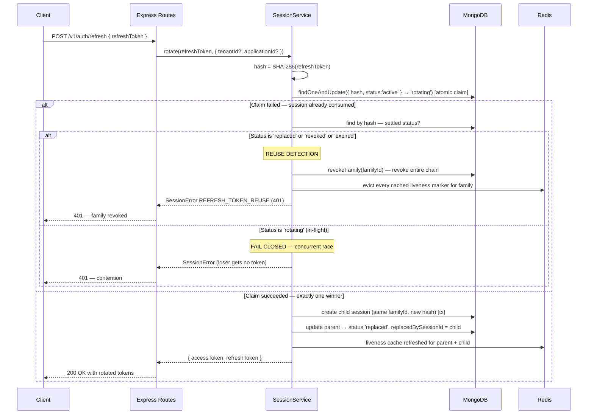
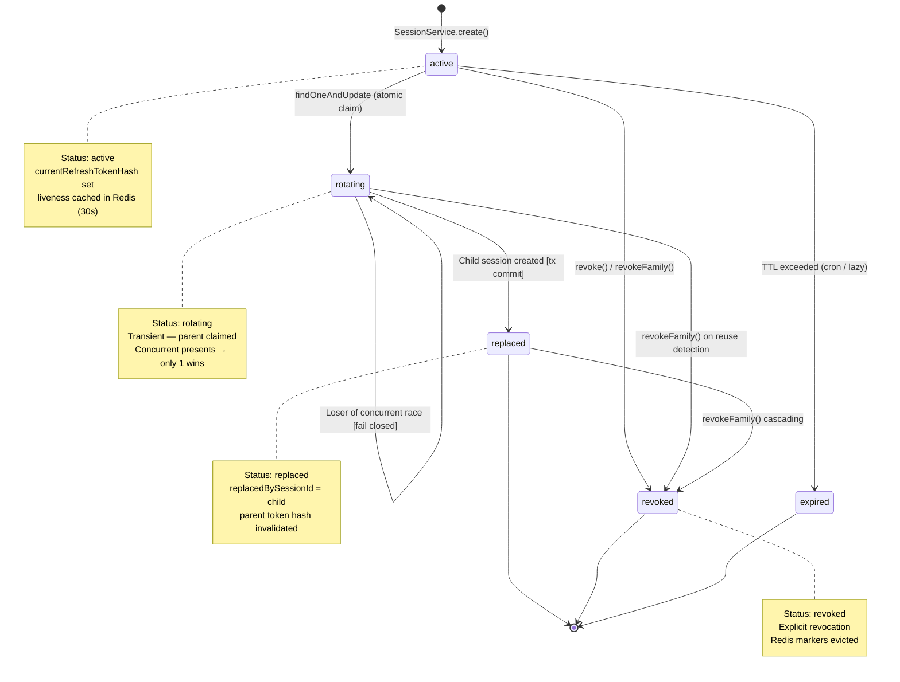
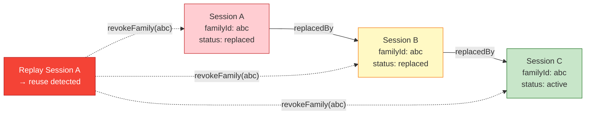

# Refresh Token Rotation

Transactional, single-use rotation with reuse detection and family revocation.

## Session Lifecycle State Diagram

## Family Chain Visualization

Key invariants:

- **Only SHA-256 hashes** of refresh tokens are stored (`session.model.ts`)
- Atomic `active → rotating` claim serializes concurrent presentations to **exactly one winner**
- MongoDB transactions wrap child creation + parent finalization
- Redis liveness markers (30s TTL) provide cheap `isSessionActive` checks
- `revokeFamily` evicts all cached markers for the entire chain
