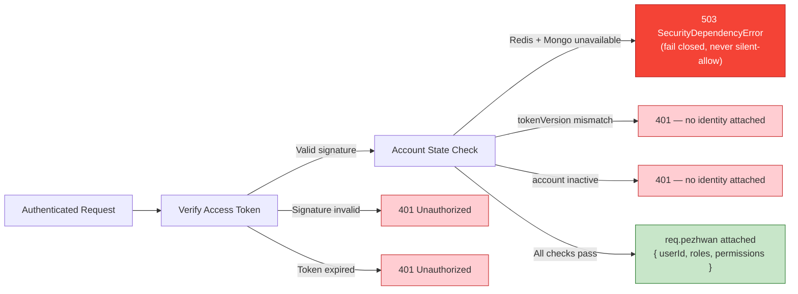

# Security Architecture — Defense in Depth

Seven layers of defense, each independent. Failure at one layer does not compromise others.

```mermaid
flowchart TB
    subgraph L1["Layer 1 — Network Security"]
        N1["TLS 1.3 (TLS_AES_256_GCM_SHA384)<br/>DDoS Protection (Cloudflare / AWS Shield)<br/>Web Application Firewall (WAF)<br/>IP Whitelisting / Blocklisting<br/>Edge Rate Limiting (10k RPS burst)"]
    end

    subgraph L2["Layer 2 — Application Security"]
        N2["CORS Strict Allowlist (never wildcard with credentials)<br/>CSRF Double-Submit Cookies (SameSite=Lax)<br/>Security Headers (CSP, HSTS, X-Frame-Options, nosniff)<br/>Input Validation (Zod schemas)<br/>NoSQL Injection Prevention<br/>Body Size Cap (100 KB default)"]
    end

    subgraph L3["Layer 3 — Authentication Security"]
        N3["Argon2id Password Hashing (64 MiB, t=3, p=1)<br/>Asymmetric JWT Signing (RS256, ES256, EdDSA)<br/>MFA: TOTP + WebAuthn/FIDO2 + Backup Codes<br/>Account Lockout (5 attempts → 15 min lock)<br/>Brute Force Protection (per-IP + per-user)<br/>Enumeration-Safe Flows (decoy tokens)"]
    end

    subgraph L4["Layer 4 — Session & Token Security"]
        N4["Short-lived Access Tokens (15 min)<br/>Rotating Refresh Tokens (one-time use)<br/>Refresh Reuse → Family Revocation (atomic)<br/>HttpOnly + Secure + SameSite Cookies<br/>JWKS Key Rotation (kid-based, 30-day)<br/>Key State Machine: Generated → Active → Verify-Only → Retired → Revoked"]
    end

    subgraph L5["Layer 5 — Authorization Security"]
        N5["Deny-by-Default<br/>RBAC (roles + permissions, tenant-scoped)<br/>ABAC (attribute-based policies)<br/>Tenant Isolation (all queries scoped)<br/>Permission Checks Server-Side<br/>IDOR / BOLA Prevention<br/>Identity derived from verified JWT, never client body"]
    end

    subgraph L6["Layer 6 — Data Security"]
        N6["Encryption at Rest (MongoDB + AES-256)<br/>Encryption in Transit (TLS 1.3)<br/>Secrets Hashed at Rest (SHA-256)<br/>HSM / KMS for Signing Keys<br/>Tamper-Evident Audit Log Chain (SHA-256)<br/>Never Log Passwords, Tokens, OTPs"]
    end

    subgraph L7["Layer 7 — Observability & Incident Response"]
        N7["Structured Logging (redacted, requestId context)<br/>Prometheus Metrics + Grafana Dashboards<br/>OpenTelemetry Distributed Tracing<br/>Security Alerts (breach detection)<br/>Incident Response Runbooks<br/>Quarterly DR Drills"]
    end

    L1 --> L2 --> L3 --> L4 --> L5 --> L6 --> L7

    style L1 fill:#e3f2fd,stroke:#1565c0
    style L2 fill:#e8f5e9,stroke:#2e7d32
    style L3 fill:#fff3e0,stroke:#e65100
    style L4 fill:#fce4ec,stroke:#c62828
    style L5 fill:#f3e5f5,stroke:#6a1b9a
    style L6 fill:#e0f2f1,stroke:#00695c
    style L7 fill:#fff9c4,stroke:#f57f17
```

## Fail-Closed Default

```mermaid
flowchart LR
    REQ["Authenticated Request"]
    VERIFY["Verify Access Token"]
    ACCOUNT["Account State Check"]

    REQ --> VERIFY
    VERIFY -->|"Signature invalid"| DENY1["401 Unauthorized"]
    VERIFY -->|"Token expired"| DENY2["401 Unauthorized"]
    VERIFY -->|"Valid signature"| ACCOUNT

    ACCOUNT -->|"Redis + Mongo unavailable"| FAIL_CLOSED["503 SecurityDependencyError<br/>(fail closed, never silent-allow)"]
    ACCOUNT -->|"tokenVersion mismatch"| DENY3["401 — no identity attached"]
    ACCOUNT -->|"account inactive"| DENY4["401 — no identity attached"]
    ACCOUNT -->|"All checks pass"| ALLOW["req.pezhwan attached<br/>{ userId, roles, permissions }"]

    style DENY1 fill:#ffcdd2,stroke:#c62828
    style DENY2 fill:#ffcdd2,stroke:#c62828
    style DENY3 fill:#ffcdd2,stroke:#c62828
    style DENY4 fill:#ffcdd2,stroke:#c62828
    style FAIL_CLOSED fill:#f44336,color:#fff,stroke:#b71c1c
    style ALLOW fill:#c8e6c9,stroke:#2e7d32
```
