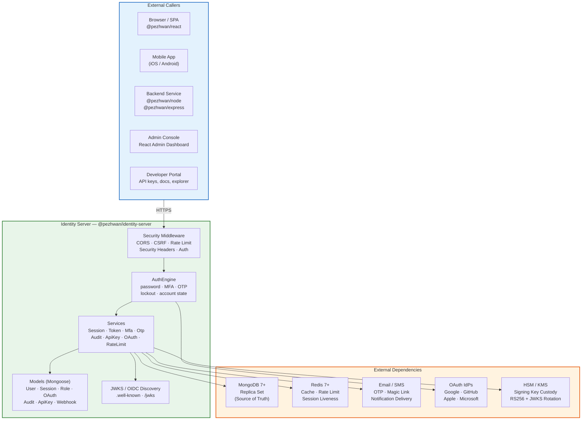

# System Overview Diagram

High-level architecture showing all external callers, the Identity Server internals, and external dependencies.

```mermaid
flowchart TB
    subgraph CLIENTS["External Callers"]
        direction LR
        BR["Browser / SPA<br/>@pezhwan/react"]
        MB["Mobile App<br/>(iOS / Android)"]
        API["Backend Service<br/>@pezhwan/node<br/>@pezhwan/express"]
        ADM["Admin Console<br/>React Admin Dashboard"]
        DEV["Developer Portal<br/>API keys, docs, explorer"]
    end

    subgraph SERVER["Identity Server — @pezhwan/identity-server"]
        direction TB
        MIDDLEWARE["Security Middleware<br/>CORS · CSRF · Rate Limit<br/>Security Headers · Auth"]
        AUTH["AuthEngine<br/>password · MFA · OTP<br/>lockout · account state"]
        SERVICES["Services<br/>Session · Token · Mfa · Otp<br/>Audit · ApiKey · OAuth · RateLimit"]
        MODELS["Models (Mongoose)<br/>User · Session · Role · OAuth<br/>Audit · ApiKey · Webhook"]
        JWKS["JWKS / OIDC Discovery<br/>.well-known · /jwks"]

        MIDDLEWARE --> AUTH
        AUTH --> SERVICES
        SERVICES --> MODELS
    end

    subgraph DEPS["External Dependencies"]
        direction LR
        MONGO["MongoDB 7+<br/>Replica Set<br/>(Source of Truth)"]
        REDIS["Redis 7+<br/>Cache · Rate Limit<br/>Session Liveness"]
        EMAIL["Email / SMS<br/>OTP · Magic Link<br/>Notification Delivery"]
        IDP["OAuth IdPs<br/>Google · GitHub<br/>Apple · Microsoft"]
        HSM["HSM / KMS<br/>Signing Key Custody<br/>RS256 + JWKS Rotation"]
    end

    CLIENTS -->|"HTTPS"| MIDDLEWARE
    SERVICES --> MONGO
    SERVICES --> REDIS
    SERVICES --> EMAIL
    AUTH --> IDP
    SERVICES --> HSM
    SERVICES --> JWKS

    style CLIENTS fill:#e3f2fd,stroke:#1565c0,stroke-width:2px
    style SERVER fill:#e8f5e9,stroke:#2e7d32,stroke-width:2px
    style DEPS fill:#fff3e0,stroke:#e65100,stroke-width:2px
```
